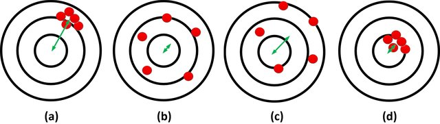
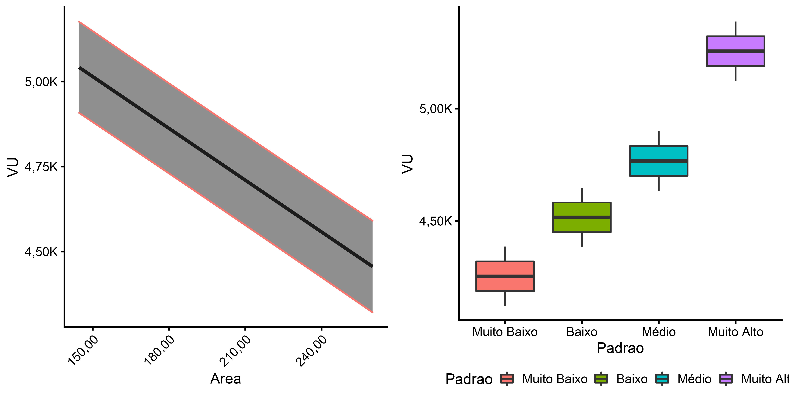

```{r,setup, include=FALSE}
knitr::opts_chunk$set(echo = FALSE, cache=TRUE, echo = FALSE, 
                      out.width = "70%", fig.align = "center")
library(ggplot2)
library(cowplot)
theme_set(theme_cowplot(12))
library(truncnorm)
library(quantreg)
library(appraiseR)
library(sf)
library(latex2exp)
```

# Regressão Linear

## Definição

>- A regressão linear é uma função que *estima* o valor da *média condicional* de
uma população [@matloff2017, 10-11].
>   + P. ex.: 
>     + $VU = \beta_0 +  \beta_1A + \beta_2F + \varepsilon$
>     + $\mu(VU) = \mathbb E [VU|A, F] = \beta_0 + \beta_1A + \beta_2F + \mathbb E[\varepsilon]$
>     + Se $\varepsilon \approx N(0, \sigma^2)$
>     + $\mu(VU) = \mathbb E [VU|A, F] = \beta_0 + \beta_1A + \beta_2F$
>   + São estimados $\hat \beta_0, \hat \beta_1, \hat \beta_2 \,e\,\hat \varepsilon$
>   + Caso o modelo seja bem especificado, $\hat \varepsilon^2 \approx \sigma^2$
>- A equação estimada pode ser utilizada para fazer estimativas e previsões
>   + P. ex.: Qual o *valor unitário médio* (ou esperado) de um lote, dado que ele possui $A = 360m^2$ e $F = 12m$?
>     + $\mathbb E [VU|A = 360, F = 12] = \hat \beta_0 + \hat \beta_1 \cdot 360 + 
  \hat \beta_2 \cdot 12 + \mathbb E[\hat \varepsilon]$
>     + $\mathbb E [VU|A = 360, F = 12] = \hat \beta_0 + \hat \beta_1 \cdot 360 + 
  \hat \beta_2 \cdot 12$
>     + Incerteza do estimador deve ser verificada com IC
>   + Mas qual o valor de um novo lote, dado que ele possui $A = 360m^2$ e $F = 12m$?
>     + $\hat{VU} = \hat \beta_0 + \hat \beta_1 \cdot 360 + \hat \beta_2 \cdot 12 + 
\hat \varepsilon$
>     + Incerteza na predição deve ser verificada com IP
  
## Função média condicional

```{r, fig.cap="Médias Condicionais."}
#knitr::include_graphics("../../images/conditionalMeans.png")

```

## Estimação vs. previsão de valores

>- Sir Francis @galton [p. 62] [*apud* 
@koenker2000, p. 350] criticou os seus colegas que:
>   + \emph{limitam suas investigações a médias, e não parecem se deleitar com
visões mais abrangentes. Suas almas parecem tão enfadonhas ao encanto da
variedade quanto ao de um nativo de um de nossos condados ingleses planos, cuja
retrospectiva da Suíça foi que, se as montanhas pudessem ser jogadas em seus
lagos, dois incômodos seriam removidos de uma só vez.}
>- Estimação é para parâmetros da população (média, variância, coeficientes, ...)
>- Previsão é para novos dados da população (fora da amostra).

## Estimação: outros quantis de dados

```{r qr, out.width = "50%", fig.cap="Regressão Quantílica."}
#
set.seed(5)
x = rtruncnorm(500, a = 125, b = 600, mean = 360, sd = 100)
b0 = 2500 # intercept chosen at your choice
b1 = 0 # coef chosen at your choice
h = function(x) 250 - .25*x # h performs heteroscedasticity function (here I used a linear one)
i = function(x) b0 + .25*x # lower bound limit
y = rtruncnorm(500, a = i(x), mean = b0, sd = h(x))
#y = b0 + b1*x + eps - h(x)
dados <- data.frame(VU = y, Area = x)
#X <- X[which(X[, "y"] > 2400), ]
fit <- lm(VU ~ Area, data = dados)
fit1 <- rq(VU ~ Area, tau = .10, data = dados)
fit2 <- rq(VU ~ Area, tau = .25, data = dados)
fit3 <- rq(VU ~ Area, tau = .50, data = dados)
fit4 <- rq(VU ~ Area, tau = .75, data = dados)
fit5 <- rq(VU ~ Area, tau = .90, data = dados)
fit6 <- rq(VU ~ Area, tau = .95, data = dados)
par(mar=c(5,5,2,6), bg = "light blue")
plot(VU ~ Area, data = dados, main = "A importância de analisar todos os quantis",
     xlab = expression("Área"~(m^2)),
     ylab = expression("VU (R$/"~m^2~")"), pch = 20)
abline(fit, lty = 2, lwd = 2)
abline(fit1, col = "yellow")
abline(fit2, col = "red")
abline(fit3, col = "green")
abline(fit4, col = "blue")
abline(fit5, col = "darkred")
abline(fit6, col = "darkblue")
legend('topleft', xpd = TRUE, inset=c(1,0), bty = "n",
       legend=c(".10", ".25", ".50", ".75", ".90", "0.95", "mean"),
       col = c("yellow", "red", "green", "blue", "darkred", "darkblue", "black"), 
       lty = c(rep(1, 6), 2),
       lwd = c(rep(1,6), 2),
       title= expression(~tau), text.font=4, bg='lightblue')
```


## Estimação vs. previsão de valores

>- A NBR 14.653-02[@NBR1465302] parece ter também este entendimento:
>   + **8.2.1.5.4** O campo de arbítrio não se confunde com o intervalo de 
confiança de 80 % calculado para definir o grau de precisão da estimativa. 
>- No Anexo A, no entanto, a NBR 14.653-02 [@NBR1465302] parece misturar as coisas:
>   + **A.10.1.2** Quando for adotado o valor arbitrado, o intervalo de valores 
admissíveis deve estar limitado simultaneamente (ver Figura A.2):  
>   + a) ao intervalo em torno do valor arbitrado com amplitude igual à do 
\emph{intervalo de predição \textbf{ou ao intervalo de confiança}} de 80% para a 
estimativa de tendência central;
>   + b) ao campo de arbítrio em torno da estimativa de tendência central. 


# Por que arbitrar um valor diferente da média condicional?

## Campo de Arbítrio

>- **campo de arbítrio**  
intervalo de variação no entorno do estimador pontual adotado na avaliação, 
dentro do qual pode-se arbitrar o valor do bem, \textbf{desde que justificado 
pela existência de características próprias não contempladas no modelo}.
[@NBR1465301, 3, grifo nosso]

>- **8.2.1.5.2** O campo de arbítrio pode ser utilizado \textbf{quando variáveis 
relevantes para a avaliação do imóvel não tiverem sido contempladas no modelo}, 
por escassez de dados de mercado, por inexistência de fatores de homogeneização 
aplicáveis ou porque essas variáveis não se apresentaram estatisticamente 
significantes em modelos de regressão, desde que a amplitude de até mais ou 
menos 15 % seja suficiente para absorver as influências não consideradas e que 
os ajustes sejam justificados.  
[@NBR1465302, 17, grifo nosso]

>- \emph{\textbf{Características próprias não contempladas no modelo}} *vs.* 
\emph{\textbf{variáveis relevantes não contempladas no modelo.}}

## Problema da omissão de variável relevante

>- A NBR 14.653-2 não apresenta uma definição rigorosa de \emph{variável 
relevante}.
>- Seleção de variáveis é um tema complexo para o qual os estatísticos ainda não
tem solução fechada.
>- Mas é consenso que, para evitar *overfitting*, nem todas as variáveis podem
ser incluídas no modelo final
>   + $p < \sqrt{n}$ (John Tukey *apud* @matloff2017)
>- Mesmos variáveis com significância estatística podem ter que ser retiradas do
modelo

## Além da omissão de variáveis relevantes

### Viés e Variância

```{r, fig.cap="Viés e Variância. Fonte: \\textcite{ghojogh2019theory}."}

```

## Tradeoff

```{r, out.width="25%", fig.cap="Overfitting. Fonte: \\textcite{ghojogh2019theory}."}

```

## Capacidade do Modelo

>- Não se pode incluir todas as variáveis
  
```{r, fig.cap="Capacidade do modelo. Fonte: autor desconhecido.", out.width="40%"}

```

>- Moral da estória: \emph{If I had more time, I would have written a shorter
letter} -- Blaise Pascal *apud* @matloff2017.

<!-- ```{r, fig.cap="Capacidade do modelo. Fonte: \\textcite{odriscoll2019physics}."} -->
<!--  -->
<!-- ``` -->


<!-- ```{r, fig.cap="Capacidade do modelo. Fonte: \\textcite{ghojogh2019theory}.", out.width="50%"} -->
<!-- knitr::include_graphics("../../images/The-overfitting-of-model.jpg") -->
<!-- ``` -->

## Seleção de Variáveis

```{r}
knitr::include_graphics("../../images/modelo.png")
```

## Seleção de Variáveis

```{r}
data(centro_2015)
dados <- st_drop_geometry(centro_2015)
dados$padrao <- as.numeric(dados$padrao)
fit <- lm(log(valor)~area_total + quartos + suites + garagens +
            log(dist_b_mar) + I(1/padrao), dados, subset = -c(31, 39))
library(leaps)
b <- regsubsets(log(valor)~area_total + quartos + suites + garagens +
            log(dist_b_mar) + I(1/padrao), dados[-c(31, 39), ])
rs <- summary(b)
#summary(fit)
fit1 <- update(fit, .~.-suites)
```

```{r regsub2, fig.width = 6, fig.height = 3, fig.cap="Seleção de Variáveis baseada em critérios de qualidade.", out.width = "80%"}
df <- data.frame(n = 1:length(rs$bic), BIC = rs$bic, R2 = rs$adjr2)
p1 <- ggplot(df, aes(x = n, y = BIC)) + 
  geom_point() +
  geom_line() +
  labs(x = "Número de Regressores", y = "Bayes IC")
p2 <- ggplot(df, aes(x = n, y = R2)) + 
  geom_point() +
  geom_line() +
  labs(x = "Número de Regressores", y = TeX("$R^2_{ajustado}$"))
cowplot::plot_grid(p1, p2, labels = c("A", "B"))
#
```


## Seleção de  Variáveis

```{r}
plot(b)
```


## Seleção de  Variáveis

```{r}
new <- dados[52, ]
p <- predict(fit, newdata = new, interval = "confidence", level = .80)
p1 <- predict(fit1, newdata = new, interval = "confidence", level = .80)
P <- predict(fit, newdata = new, interval = "prediction", level = .80)
P1 <- predict(fit1, newdata = new, interval = "prediction", level = .80)
# p; p1
# P; P1
```

>- Modelo com variável suítes, IC: `r brf(exp(p))`; Amplitude: `r brf(amplitude(exp(p)))`%
>- Modelo sem variável suítes, IC: `r brf(exp(p1))`; Amplitude: `r brf(amplitude(exp(p1)))`%
>- Modelo com variável suítes, IP: `r brf(exp(P))`; Amplitude: `r brf(amplitude(exp(P)))`%
>- Modelo sem variável suítes, IP: `r brf(exp(P1))`; Amplitude: `r brf(amplitude(exp(P1)))`%


## Exemplo

>- Na impossibilidade de se modelar todas as variáveis, cabe ao profissional de 
Engenharia de Avaliações identificar quando um imóvel tem valor acima ou abaixo 
da média do mercado
>   + P. ex.: Existem diversos lotes com $A = 360m^2$ e $F = 12m$, porém nem todos são iguais
>     + Um possui melhor pedologia ($Ped$)
>     + Outro possui melhor Topografia ($Topo$)
>     + Outro possui melhor Posição na Quadra ($PQ$)
>     + Outro tem melhor Posição Solar ($PS$)
>     + Devido a estas pequenas diferenças, $\varepsilon \ne 0$
>     + Porém, um lote em específico pode ter melhor $Ped, Topo, PQ \,\textbf{e}\, PS$.
>     + Enquanto outro pode ter pior  $Ped, Topo, PQ \,\textbf{e}\, PS$.
>     + O valor médio estimado pelo modelo é R\$100,00/$m^2$
>     + É justo avaliá-los com o valor médio?
    
# Estudos de casos

## Omissão de variável relevante

```{r, fig.cap="Omissão de variável relevante: quatro exemplos ilustrativos. Fonte: os autores."}
# seed <- 1
# epsilonsd <- 100
# set.seed(seed)
# area <- c(360, 360, 360, 360, 480, 480, 360, 360, 480, 480)
# situacao <- c(rep(0, 4), rep(1, 2), rep(0, 4))
# VU <- 5000 - 5*area + 250*situacao + rnorm(10, 0, epsilonsd)
# dados1 <- data.frame(VU, Area = area, 
#                     Situacao = factor(situacao, 
#                                       levels = c(0, 1), 
#                                       labels = c("Meio de Quadra", "Esquina")))
# VU <- 5000 - 5*area + 390*situacao + rnorm(10, 0, epsilonsd)
# dados2 <- data.frame(VU, Area = area, 
#                     Situacao = factor(situacao, 
#                                       levels = c(0, 1), 
#                                       labels = c("Meio de Quadra", "Esquina")))
# VU <- 5000 - 5*area + 780*situacao + rnorm(10, 0, epsilonsd)
# dados3 <- data.frame(VU, Area = area, 
#                     Situacao = factor(situacao, 
#                                       levels = c(0, 1), 
#                                       labels = c("Meio de Quadra", "Esquina")))
# VU <- 5000 - 5*area + 1500*situacao + rnorm(10, 0, epsilonsd)
# dados4 <- data.frame(VU, Area = area, 
#                     Situacao = factor(situacao, 
#                                       levels = c(0, 1), 
#                                       labels = c("Meio de Quadra", "Esquina")))
# fit1 <- lm(VU ~ Area + Situacao, dados1, x = TRUE, y = TRUE)
# fit2 <- lm(VU ~ Area + Situacao, dados1, x = TRUE, y = TRUE)
# fit3 <- lm(VU ~ Area + Situacao, dados1, x = TRUE, y = TRUE)
# fit4 <- lm(VU ~ Area + Situacao, dados1, x = TRUE, y = TRUE)

```

## Omissão de variável relevante

- Qual o valor de um lote dado que $A = 480 \, e\, PQ = 1$

>- A NBR 14.653-2 prevê a utilização do CA
>- Entendemos que o CA pode ser um bom fator limitante
>- Mas não dá qualquer parâmetro para a previsão de valores
>   + P. Ex.: Lote em situação de esquina, sem variável situação
>    + Pode-se utilizar o CA. Mas em qual magnitude?
>    + Quanto a posição na quadra valoriza o lote em relação à situação de 
>    meio-de-quadra?
>    + Intervalos de Predição podem ser instrutivos

## Micronumerosidade

>- \alert<1>{Modelo sem micronumerosidade}

```{r, fig.cap="Micronumerosidade: perda de informação no modelo. Fonte: os autores."}

```

>- \alert<2>{Quanto vale imóvel de Padrão Alto? (Com código alocado seria possível \cite[A.6]{NBR1465302})}

## Micronumerosidade (2)

>- \alert<1>{Modelo com poucos dados de padrão alto (<3)}

```{r, fig.cap="Pequeno número de dados: Estimação pobre. Fonte: os autores."}

```

>- \alert<2>{$Var(VU|Padrao = Alto) > Var(VU| Padrao \ne Alto)$. Se atende GP, por que não?}

## Avaliação Intervalar

```{r, results='hide', message=FALSE, fig.cap="Avaliação Intervalar. Intervalos incoerentes.", out.width="50%"}
mean <- 100
sd <- 7.5
pl1 <- mosaic::xqnorm(c(.10, .5, .90), mean = mean, sd = sd, 
                      return = "plot", system = "gg", digits=3) + 
  theme(legend.position="bottom") + 
  guides(fill=guide_legend(title="Prob."))
pl2 <- mosaic::xqnorm(c(.2, 
                        pnorm(110, mean = mean, sd = sd), 
                        pnorm(115, mean = mean, sd = sd)), 
                      mean = mean, sd = sd,
                      return = "plot", system = "gg", digits=3) + 
  theme(legend.position="bottom") + 
  guides(fill=guide_legend(title="Prob."))
cowplot::plot_grid(pl1, pl2)
```

>- Faz sentido arbitrar um valor maior do que a média e reportar um intervalo
admissível com valores abaixo da média?

## Avaliação Intervalar (2)

```{r, fig.cap="Estimação intervalar: uma abordagem probabilística. Fonte: os autores."}

```

>- Arbitragem de valor acima da média: 
>   + valores admissíveis: $[IC_{inf}; CA_{sup}]$ ou $[IC_{inf}; IP_{sup}]$
>   + valores admissíveis: $[IC_{inf}; min(CA_{sup}, IP_{sup})]$
>   + valores admissíveis: $Y_{arb} \pm min(Y_{arb} - IC_{inf}; min(IP_{sup}, CA_{sup}) - Y_{arb})$ (simétrico)

# Conclusões

>- \alert<1>{O campo de arbítrio (CA) é um artifício que possibilita ao 
avaliador a escolha de um valor para o bem-avaliando diferente do valor (médio) 
ajustado com o modelo de regressão linear.}

>- \alert<2>{A NBR 14653-2 \citeyear{NBR1465302} permite que o CA seja 
utilizado apenas quando da omissão de variável relevante. Esta exigência não 
consta na NBR 14653-1 \citeyear{NBR1465301}.}

>-  \alert<3>{O cálculo do IP é um bom parâmetro para estimar o \emph{quanto} o 
valor do bem pode/deve ser majorado ou minorado.}

>- \alert<4>{O IC não é um bom parâmetro para a arbitragem de valores para novos
dados (fora da amostra).}

>- \alert<5>{O CA deve ser utilizado, portanto, como um fator limitante, 
\textbf{em conjunto com o IP!}}

>- \alert<6>{A micronumerosidade deveria ser revista. Deixar que os dados falem!}

# Referências {-}
